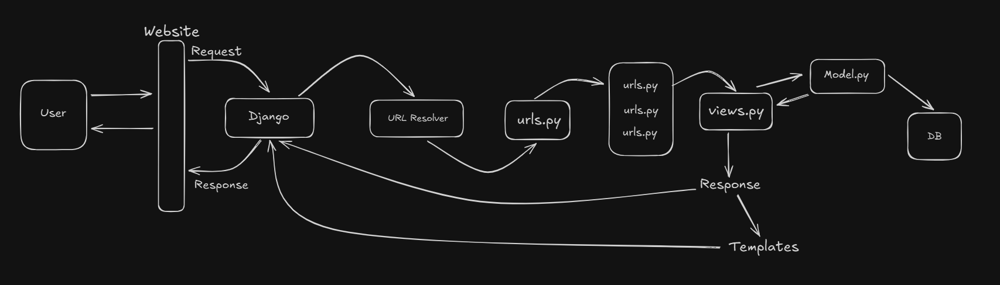

Flow of a Django Application - 

1. User makes a Request on website. User fires browser and request goes to the website. 
2. Request goes to Django. Django tries to find out which resource user is trying to access. 
3. Django contains one 'URL Resolver' which is runs in backend. Resolver is core inbuilt in Django. Objective of Resolver is to find exactly which url user is interested in (ie. home page, about page, or id page etc.). 
4. Resolver redirects to that particular url.py file. 
5. 'views.py' is the main controller which is responsible to give response. views file also can contact with DB or model file. 'models.py' is the file which is responsible to interact with database.
6. Response from views file is directly sent to Django which further gives response to the user. 
7. Sometimes views also make use of Templates to give response. 

In `views.py`;
```python
from django.http import HttpResponse
from django.shortcuts import render

def home(request):
    # return HttpResponse("Hello, world. Django Home page at SSM.")
    return render(request, 'website/index.html')

def about(request):
    return HttpResponse("Hello, world. Django About page at SSM.")

def contact(request):
    return HttpResponse("Hello, world. Django Contact page at SSM.")
```
- To give response or take request we need to import 'HttpResonse' library. 
- We need to import 'render' library to use templates.
- We need to define a function which will take 'request' as parameter. This function will be responsible to give response.
- We can't use 'HttpResponse' with templates. We need to use 'render' function to use templates.


To handle URLS we go to `urls.py`;
```python
from django.contrib import admin
from django.urls import path
from . import views

urlpatterns = [
    path('admin/', admin.site.urls),
    path('', views.home, name='home'), 
    path('about/', views.about, name='about'),
    path('contact/', views.contact, name='contact'),
]
```
- Blank path is for Home page. You need to give name for other paths. 


**Templates**
Templates folder is created at the root folder of our project. Templates contains HTML files. 
We also create **static** folder which contains css or js files. 

- Create a simple HTML file in templates. 
Now, to load templates and return back, we use **render** in `views.py` file. 
```python
from django.shortcuts import render
def home(request):
    return render(request, 'index.html')
```

**Load Templates**:
- In `settings.py`, in 'TEMPLATES' section, add *'DIRS':['templates']*. 

**Load Static (CSS or JS)**:
- Add css file in static folder. 
- link css in HTML file. 
- In Django we have templating engine which is a special structure used to load static files. HTML file can work as templating engine. 
- In templating engine we can enject our programatical code anywhere in the app. 
- We can use `` in HTML file in link tag to load static files.
- Don't forget to write `` at the top of HTML file. 

**Configure in setting.py file**: 
- `import os` in top of setting.py. 
- Just below 'STATIC_URL = 'static/'' line of code, write `STATICFILES_DIRS = [os.path.join(BASE_DIR, 'static')]`. 
- Now our CSS have been Injected in Application. 
- similarly we can load JS file. 